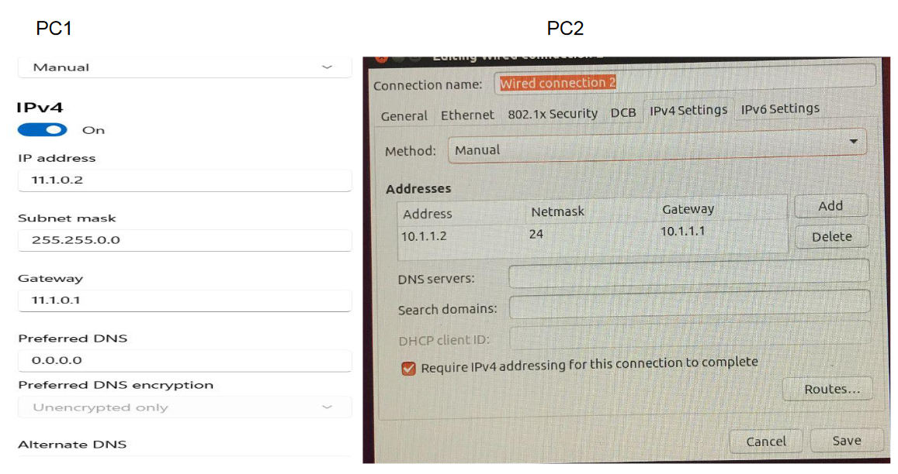

# cisco-router-setup
Network setup and router configuration(Model 2900)
This practical is part of the course for CSL605  in IIT Bhilai.

## Network Setup and Route Configuration in Router

## Requirements
* 2 Cisco Routers (Model 2900), 3 LAN cables, 1 Console cable(serial to USB) and 3 generic PCs (1 to connect to console port for router configuration).
* Connect one LAN cable from PC1 to GE 0/0 of R1.
* Similarly connect another LAN cable from PC2 to GE 0/1 of R2.
* Connect GE 0/2 of R1 with GE 0/0 of R2 using the third LAN.
* In order to connect to the routers using putty there might be driver issue, this can be resolved by checking the driver details on the usb to serial cable in our case we had to download the drivers for ATEN 1023 from this website https://www.aten.com/global/en/supportcenter/info/downloads/?action=display_product&pid=575 before this we kept getting the error "file not found".

| Devices      | IP             | Subnet-mask   |Gateway        |INterfaces     |
|:------------:|:--------------:|:-------------:|:-------------:|:-------------:|
| PC1          | 11.1.0.2       | 255.255.0.0   |11.1.0.1       |Ethernet       |   
| PC2          | 10.1.1.2       | 255.255.255.0 |10.1.1.1       |Ethernet       |
| Router (R1)  | 11.1.0.1       | 255.255.0.0   |               |GE 0/0         |
| Router (R1)  | 192.168.1.1    | 255.255.255.0 |               |GE 0/2         |
| Router (R2)  | 10.1.1.1       | 255.255.255.0 |               |GE 0/1         |
| Router (R2)  | 192.168.1.2    | 255.255.255.0 |               |GE 0/0         |

### Static IP allocation in PC1 and PC2

### Router configuration(for R1) 
#### configure Putty

#### R1 and R2 files
[Link to R1](RouterConfig/r1)

[Link to R2](RouterConfig/r2)

Cheetsheet to understand the commands 
https://www.netwrix.com/cisco_commands_cheat_sheet.html

### Testing 
you can test the connection using standard ping and traceroute commands

#### ping test 

#### traceroute test 

### router configuration check
You can check router configuration using sh run command for routers

